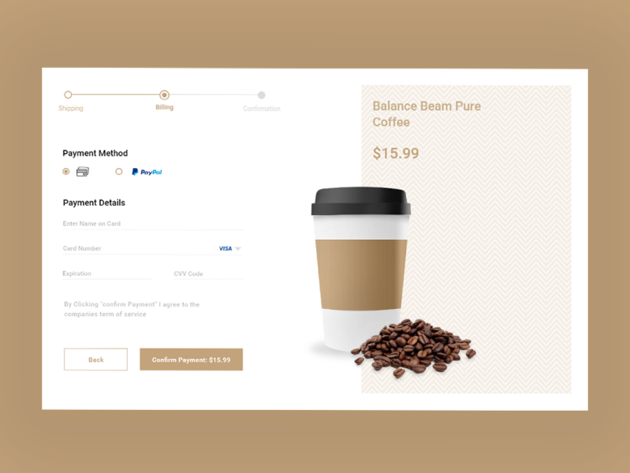

<!DOCTYPE html>
<html lang="en">
<head>
<meta charset="UTF-8">
<meta name="viewport" content="width=device-width, initial-scale=1.0">
</head>
<body>
  <h1 class="heading">Project Description</h1>
  
Cozy Cup Cafe is a web application designed to provide users with a virtual cafe experience where they can explore various coffee blends, order beverages, and connect with other coffee enthusiasts.

  <h2 class="heading">Features</h2>
  <ul>
    <li>Browse a diverse selection of coffee blends.</li>
    <li>Place orders for beverages and snacks.</li>
    <li>Join virtual coffee rooms to chat with other users.</li>
    <li>Customize beverage preferences.</li>
    <li>Receive personalized recommendations based on past orders.</li>
  </ul>

  <h2 class="heading">Screen Captures</h2>
  

    
    
<strong>Description:</strong> Home page displaying featured coffee blends and special offers.

  

  

    
    
<strong>Description:</strong> User profile page showing past orders and personalized recommendations.

  

  

    
    
<strong>Description:</strong> Virtual coffee room interface where users can join discussions and share their coffee experiences.

  

  

    
    
<strong>Description:</strong> Checkout page for placing orders with options to customize beverage selections.

  

  <h2 class="heading">About the Authors</h2>
  
  <ul>
    <li><strong>Name:</strong> DELERA, Kurt Adrian D.</li>
    <li><strong>Email:</strong> delerakurt2@gmail.com</li>
  </ul>

  
Connect with us:

  
  
</body>
</html>
